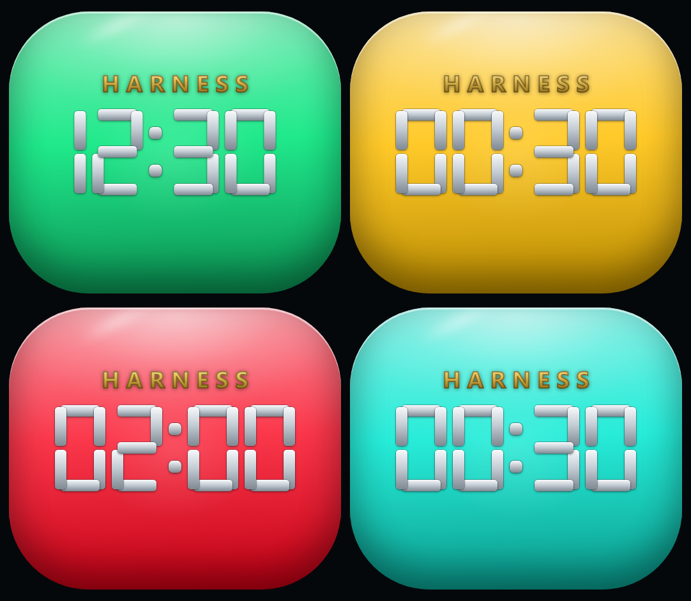

# Drop Traffic Light

A desktop widget for Windows: a glossy tile shaped like an AirPods case, lying
horizontally (54 : 46), that shows how long is left until the current peak /
off-peak phase changes. The colour of the tile *is* the state — no labels, no
panels, no window.



## Download

**[Latest release →](https://github.com/albertplastauto/drop-traffic-light/releases/latest)** —
one ZIP with everything, no Git needed. Unpack it anywhere and run
`start-widget.bat`. The release ZIP is exactly the files in this repository at
the tagged version.

## What it does

| Tile colour | When (local time) | Meaning |
|---|---|---|
| 🟢 green | Mon–Fri 00:00–03:00, 07:00–08:00, 13:00–24:00 and **all weekend** | off-peak |
| 🟡 yellow | Mon–Fri 03:00–04:00 and 08:00–09:00 | one hour before a peak |
| 🔴 red | Mon–Fri 04:00–06:00 and 09:00–12:00 | peak, restricted |
| 🩵 turquoise | Mon–Fri 06:00–07:00 and 12:00–13:00 | one hour before the peak ends |

Peak windows are **04:00–07:00** and **09:00–13:00**, Monday to Friday.
Weekends are off-peak around the clock, so the tile simply stays green.

## The clock

The big number is a seven-segment clock: **HH∶MM left until the next phase
change**, with vertical separator dots in the Casio manner. The bars are
mercury-grey metal — no backing panel, they sit straight on the tile.
The hours can run into two digits: on Friday evening the countdown to Monday
morning reads `62:00`. The dots blink once a second.

Above the digits sits a small gold brand plate, uppercase with wide tracking,
the way a watch dial carries its maker. It is not plain gold: the letters are
filled with a gold gradient and outlined in dark bronze, because a flat gold
wordmark disappears on the yellow and turquoise phases — the outline is what
keeps it readable on all four. `?brand=0` (or `#brand=0`) hides it entirely.

## Smooth colour

Colour never snaps. The fade lasts 120 seconds, half before and half after the
boundary, so exactly at the moment of the switch the colour sits halfway between
the old and the new one and there is no step anywhere in time. Hue is
interpolated along the shortest arc (yellow → red runs through orange,
red → turquoise through blue), which keeps the middle of a fade from going
muddy. The inner light breathes faster as the phase gets more restrictive:
4.4 s off-peak, 2.6 s yellow and turquoise, 1.8 s red.

## Files

| File | Purpose |
|---|---|
| `index.html` | the widget itself — HTML + CSS + JS in one file, no dependencies, no network |
| `widget-host.ps1` | Windows host: a frameless, transparent desktop window (WPF + WebView2) |
| `widget-host-browser.ps1` | fallback host for machines without WebView2 (hosts the page in Edge/Chrome) |
| `start-widget.bat` | put the widget on the desktop |
| `delete-widget.bat` | remove the widget from the desktop |
| `widget.ico` | the widget rendered as a multi-size icon (16-256 px) — give a shortcut of yours this icon |
| `icon.png` | the same picture at 256 px, for the README and for other uses |
| `test-logic.mjs` | 64 checks for the schedule, the countdown, the colour fade, the zone conversion and the dial's optical centring |
| `preview.png` | the four states side by side |
| `LICENSE` | MIT — use it, change it, ship it, keep the authorship notice |

`Start widget.lnk` and `Remove widget.lnk` are made locally and are **not**
shipped: a shortcut stores an absolute path, so it only works on the machine
that made it. Make your own — point it at `start-widget.bat` and give it
`widget.ico` as its icon.

## Put it on the desktop

Double-click **`start-widget.bat`**. The case appears in the top-right corner —
and that is all that appears: no title bar, no border, no taskbar button, no
white rectangle behind it.


`widget-host.ps1` owns the window itself, so there is nothing left to hide:

* a WPF window with `WindowStyle=None`, `AllowsTransparency` and
  `ShowInTaskbar=false` — no frame, no taskbar button, no Alt+Tab entry;
* the page runs in **WebView2** with `DefaultBackgroundColor = Transparent`, so
  only the case is painted: the desktop shows through everywhere else, and
  clicks outside the case land on whatever is behind it;
* the window is sized exactly to the case in DIP (54 : 46), so nothing can
  letterbox;
* a click on the case opens the Harness UI in your everyday browser.

The managed WebView2 assemblies are fetched once from nuget.org into
`%LOCALAPPDATA%\DropTrafficLight\lib` (about 800 KB). The WebView2 Runtime
itself ships with Windows 10/11 and with Edge; add `-NoDownload` to forbid the
download.

Options:

```powershell
.\widget-host.ps1 -Width 220 -X 60 -Y 60 -Topmost
```

`-Width` sets the case width in DIP (height follows the ratio, so 150 gives
150 × 128), `-X`/`-Y` set the position (`-1` snaps to the right edge) and
`-Topmost` keeps the widget above other windows.

The widget is deliberately unclosable: no close button, no frame, no taskbar
entry. To get rid of it, run **`delete-widget.bat`** — or use the menu below,
like deleting an icon from the desktop. Running `start-widget.bat` twice will
not create a second widget.

### Start with Windows

Put a shortcut to `start-widget.bat` in your Startup folder: press `Win+R`, type
`shell:startup`, drop the shortcut in there and give it `widget.ico` as its icon.
At every logon the widget comes back exactly where you last dragged it. If it is
already running, the second launch quietly does nothing, so the same shortcut is
safe to click at any time. To stop starting it with Windows, delete that shortcut.

### How it behaves

| Action | Result |
|---|---|
| Left click | brings the Harness window to the front; starts the app if it is not running |
| Right click | the widget's own menu: *Open Harness*, *Always on top*, *Remove from desktop* |
| Press and drag | moves the widget, like any desktop icon; the spot is remembered for next time |
| Click outside the case | goes to the desktop, exactly as if the widget were not there |

Two things make that work. The case is reported to Windows as a click target with
its exact rounded outline (`HTTRANSPARENT` everywhere outside it), and a
low-level mouse hook sees each press before any window does — which matters,
because the picture is painted by WebView2 child windows that would otherwise
swallow every click.

Dragging is deliberately kept out of that hook: the hook only records where the
pointer is, and a 15 ms timer puts the window there. Moving a window from inside
a mouse hook stalls the whole input pipeline while it repaints, and the widget
judders against the pointer instead of following it.

Equally important, the hook **lets every mouse move pass through untouched**.
A low-level hook that swallows moves freezes the pointer itself — the widget is
then left chasing a cursor that never moves, which looks like the widget twitching
within a millimetre while the mouse stands still. Only presses are taken; moves
and releases go on their way.

Opening Harness means raising its **window**, not opening a browser tab: the
address the desktop app listens on answers `401` without a token, so a plain tab
is a dead end. If the app is not running at all, the widget starts it, and only
as a last resort opens the address in the default browser.

**No WebView2?** `widget-host-browser.ps1` does the same job by hosting the page
in Edge/Chrome and clipping the browser window to the case outline. That route
cannot make the window transparent — Chromium paints its own window background —
so a light rectangle of browser background stays visible around the case. That
is why it is the fallback and not the default.

### Which browser?

None, for the widget itself. It draws itself with the **WebView2 Runtime** — a
Windows component that ships with Windows 11 and with Edge, and that many
Windows apps use to show web content. There is no browser window, no browser
profile and no dependency on which browser you prefer: the widget's window is
WPF, and the runtime is a separate product, so uninstalling Chrome or Edge does
not break it.

* A **left click** raises the Harness window — no browser involved. The address
  the desktop app listens on is token-protected, so a browser tab is only the
  last-resort fallback when the app cannot be found or started.
* The managed WebView2 assemblies are fetched once from nuget.org; `-NoDownload`
  forbids that.
* If the runtime really is missing, the host says so plainly and points at the
  fallback (`widget-host-browser.ps1`), which is the only part that needs Edge or
  Chrome by name.

## Click

A click (or `Enter` / `Space` while focused) opens the Harness UI at
`http://127.0.0.1:19387` in a new browser tab.

## Configuration

Everything lives in `index.html`:

| What | Where |
|---|---|
| Harness URL | `var HARNESS_URL = 'http://127.0.0.1:19387'` |
| Peak windows | `WEEKDAY_PLAN` — pairs of `[hour of day, phase]` |
| Colours and names | `STATES` — hue/saturation/lightness plus labels |
| Fade duration | `BLEND = 120 * 1000` (ms) |
| Tile size | `:root { --w: ... }` — the tile is 54 × 46 units, `--u` is 1/54 of its width |
| Optical centre | `--shift` — how far above the middle the wordmark and the dial sit, in units (`6` ≈ 2 mm on screen) |
| Corner radius | `border-radius: calc(var(--w) * 0.24)` |
| Refresh rate | `setInterval(tick, 1000)` |

In the desktop host the window itself is the tile, so `--w` resolves to the
viewport width and the case fills the window exactly.

## Time zone

The schedule has a home zone: the peak windows are 04:00-07:00 and 09:00-13:00
there, Monday to Friday. The widget converts them into the device's own zone, so
a machine in Berlin reads the same instants as 03:00-06:00 and one in Sydney as
11:00-14:00. The dial, the countdown and the announced next change are all shown
in device-local time. Moscow keeps no daylight saving, so the home zone is a
constant offset (`REF_OFFSET_MIN` in `index.html`, UTC+3), while the device zone
is left to `Date` and can shift with its own DST.

The test suite proves it: `test-logic.mjs` is written in home-zone terms and
passes unchanged in any device zone — try `TZ=Europe/Berlin`, `TZ=Australia/Sydney`
or `TZ=Asia/Kolkata` (a half-hour offset).

## Preview any state

`?now=` freezes the clock in local time — handy for checking the look:

```
index.html?now=2026-10-07T03:30    yellow
index.html?now=2026-10-07T06:30    turquoise
index.html?now=2026-10-07T10:15    red
index.html?now=2026-10-07T14:20    green
index.html?now=06:30               today at 06:30
```

`#bg=none` makes the page background transparent for a transparent host. Without
any of these the widget follows the system clock on an opaque background.

## Tests

```
node test-logic.mjs
```

The suite pulls the logic straight out of `index.html` (between the
`==LOGIC-START/END==` markers), so it exercises exactly the code the widget
runs. It covers every phase boundary, weekends, countdown lengths (including
`62:00` until Monday), the continuity of the phase track, the absence of colour
steps (never more than 4° of hue per second) and a full week swept minute by
minute — 10 080 minutes.

## Requirements

Windows 10/11 with the WebView2 Runtime (ships with Edge and with Windows 11),
PowerShell 5.1 (bundled with Windows), and Node.js only if you want to run the
tests. No build step, no dependencies in the widget itself.

## Ideas for later

**The widget as a real desktop icon (no windows at all).** Instead of hosting a
window, a small scheduled task could redraw the shortcut's `.ico` once a minute
from the same logic — the case, the mercury clock and the phase colour rendered
with `System.Drawing` — then refresh the shell with `SHChangeNotify`. That way
the widget literally *is* a desktop icon: nothing floats above the desktop, and
removing it is deleting the icon.

The catch is that Windows caches icons aggressively (`ie4uinit.exe -show` and a
`SHChangeNotify` broadcast are usually needed), and the HTML/CSS rendering would
have to be re-implemented in GDI+. Recorded here so the idea survives — it was
the owner's preferred direction, deferred in favour of the WebView2 host.

## Author

Albert Kadantsev — the copyright holder.

The design decisions, the architecture, every review and every integration were
made by the human author, who is responsible for the code in this repository.

## With assistance from

Development was carried out with the help of **DeepSeek-V4.1-Flash**, an AI
assistant. It is credited here as a tool, not as an author or rights holder:
under copyright law only a natural person can own the work. Every source file
carries the same line at the top, and the widget picture (`widget.ico`,
`icon.png`) is rendered from the widget itself.

## Contact

Questions, ideas and bug reports are welcome:

* open an [issue](https://github.com/albertplastauto/drop-traffic-light/issues) —
  the best channel, because the answer then helps everyone;
* or write to **albert.plastauto@gmail.com**.

## License

MIT, © 2026 Albert Kadantsev — see [LICENSE](LICENSE). Use it, change it, ship
it; just keep the copyright notice.
